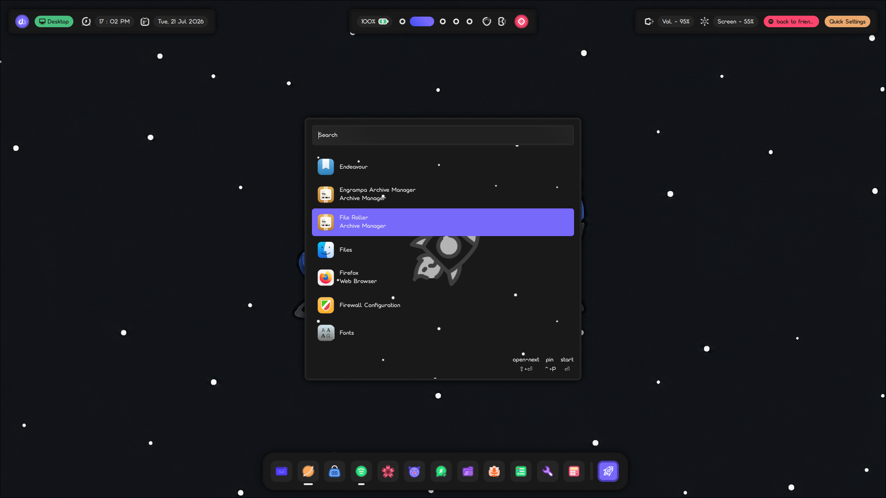

Hello! I'm Cypher, and this is my personal Hyprland rice repository.
I've used various generic things to rice and customise hyprland to my style such as Waybar, Quickshell, Walker and so on.. 
Please keep in mind that i'm still learning Quickshell so the code might not be as polished and there's chances of userbugs being introduced, i will keep improving and refining the code in future. 
Thanks for coming! 

<h3>Previews:</h3>

<h1>Desktop</h1>

<h1>Powermenu</h1>

<h1>Workspaces</h1>

<h1>App launcher</h1>

